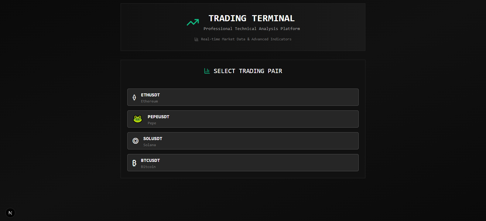
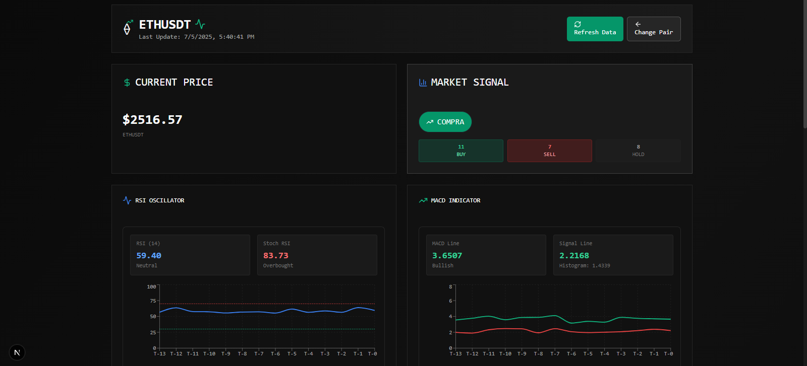
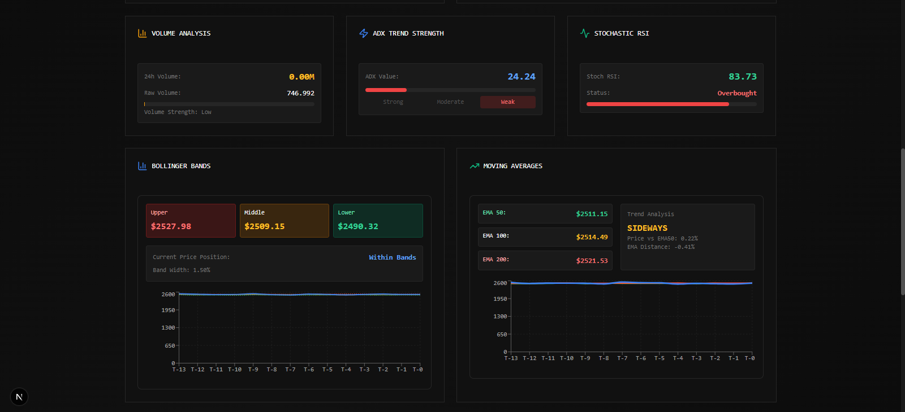
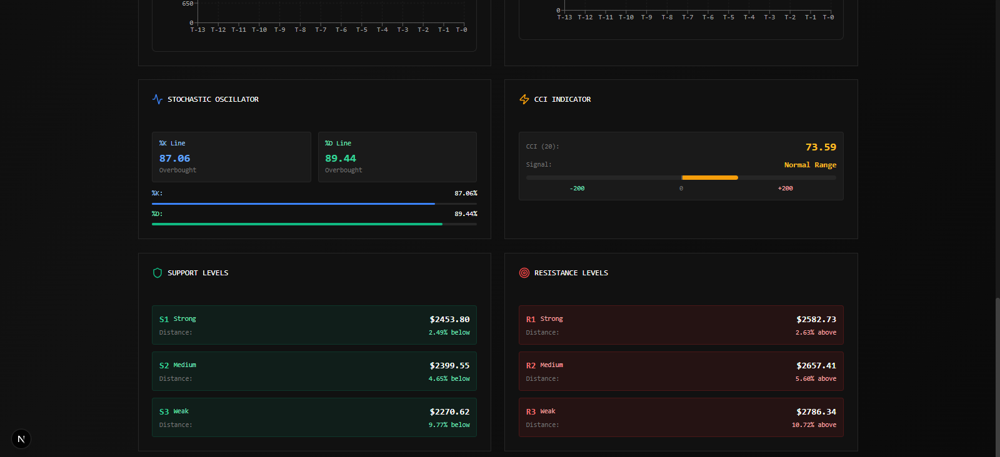
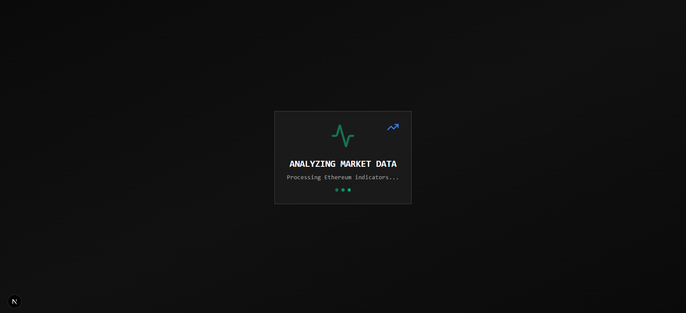

# Trading Bot UI

## 📊 Description
A modern and sophisticated cryptocurrency trading interface built with Next.js and Python. Combines a powerful frontend with advanced technical analysis to support your trading decisions.

## ✨ Features

- 🎯 Intuitive dashboard with real-time technical indicators
- 💹 Advanced price and trend visualization
- 🔄 Customizable cryptocurrency selector
- 📱 Responsive design for all devices
- 🌓 Integrated light/dark theme
- 📊 Interactive and dynamic charts
- 🤖 Python backend for technical analysis

## 🚀 Technologies

### Frontend


### Backend


## 🛠️ Installation

1. Clone the repository:
```bash
git clone https://github.com/yourusername/Trading-bot-UI.git
cd Trading-bot-UI
```

2. Install frontend dependencies:
```bash
npm install
# or
npm install --force
```

3. Install backend dependencies:
```bash
cd backend
pip install -r requirements.txt
```

## 🚀 Usage

1. Start the backend server:
```bash
cd backend
python app.py
```

2. In another terminal, start the frontend:
```bash
npm run dev
# or
pnpm dev
```


3. Open [http://localhost:3000](http://localhost:3000) in your browser.

## 📷 Capturas de pantalla

A continuación se muestran imágenes de la interfaz:

### Card


### Dashboard 1


### Dashboard 2


### Dashboard 3


### Loader


## 💡 Project Structure

```
├── app/                  # Next.js configuration and main pages
├── components/          # Reusable React components
│   ├── indicators/     # Technical indicator components
│   └── ui/            # UI components
├── backend/            # Python server and analysis logic
├── utils/             # Utilities and helpers
└── public/            # Static files
```

## 📄 License

MIT

## 👥 Contributing

Contributions are welcome. Please open an issue first to discuss what you would like to change.


